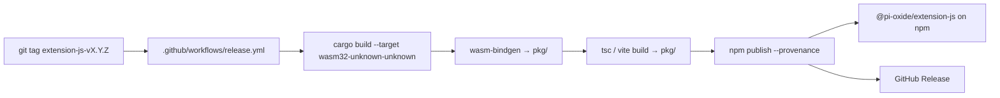

# Release process

How `@pi-oxide/extension-js` and `@pi-oxide/dom-semantic-tree` are built, published, and made reproducible — outside any manual `npm publish`.

## TL;DR for maintainers

```bash
# 1. Bump version in the source manifest:
#    - extension-js:      crates/extension-js/js/npm-package.json
#    - dom-semantic-tree: crates/dom-semantic-tree/js/package.json
# 2. Update CHANGELOG.md.
# 3. Commit, tag, push:
git commit -am "release extension-js vX.Y.Z"
git tag extension-js-vX.Y.Z     # or dom-semantic-tree-vX.Y.Z
git push origin main extension-js-vX.Y.Z
# 4. The Release workflow builds WASM + JS, verifies tag↔version, publishes to npm with provenance, and opens a GitHub Release.
```

The workflow fails loudly if:
- Tag version ≠ source manifest version
- The package is not linked to this repo on npm (provenance requirement)
- Rust tests, the WASM build, or the JS bundle fail
- Any declared publish file is missing

## Architecture



Two tag prefixes, one workflow:

| Tag prefix | Package | Source version file |
|---|---|---|
| `extension-js-v*` | `@pi-oxide/extension-js` | `crates/extension-js/js/npm-package.json` |
| `dom-semantic-tree-v*` | `@pi-oxide/dom-semantic-tree` | `crates/dom-semantic-tree/js/package.json` |

## Provenance (OIDC, no npm token)

Publishing uses npm provenance via GitHub OIDC. There is **no long-lived `NPM_TOKEN` secret**. Instead:

1. GitHub Actions mints a per-job OIDC token (`id-token: write` permission).
2. npm verifies the token against the package's configured publishing access.
3. The published tarball carries a signed provenance statement users can verify with `npm audit signatures`.

### One-time npm-side setup (per package, owner only)

For each package (`@pi-oxide/extension-js`, `@pi-oxide/dom-semantic-tree`):

1. Sign in at npmjs.com → open the package page.
2. **Settings** → **Publishing access**.
3. Connect the GitHub repository `Irvingouj/pi-web-js`.
4. (Recommended) enable **Require provenance**.

Until this link exists, `npm publish --provenance` fails with `provenance generation is disabled`. That failure is intentional — it prevents unattributed publishes.

## Version-source contract

The tag version MUST equal the source manifest version. The workflow reads:

- `crates/extension-js/js/npm-package.json#version` for `extension-js-v*`
- `crates/dom-semantic-tree/js/package.json#version` for `dom-semantic-tree-v*`

A `pkg/package.json` is produced by the build step (`scripts/build.js` + `npm run build`); it is **not** the source of truth and is gitignored. The `npm-package.json` → `pkg/` sync happens at build time, so never edit `pkg/` directly.

## Reproducing a release locally

```bash
# Build WASM + JS for extension-js
node scripts/build.js extension
cd crates/extension-js/js && npm ci && npm run build
# pkg/ now contains the publishable bundle; npm publish from there (without --provenance for a dry run)
cd pkg && npm publish --dry-run
```

## Known metadata note

`@pi-oxide/dom-semantic-tree@0.2.0` was published with `"license": "LicenseRef-PiccoloNotebook-Fair-BYOK-1.0"` — a stale string from another project. The source `crates/dom-semantic-tree/js/package.json` correctly says `MIT OR Apache-2.0`; the next provenance publish will correct it.
